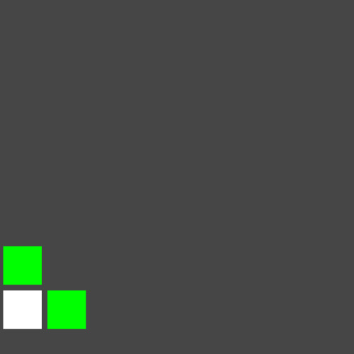
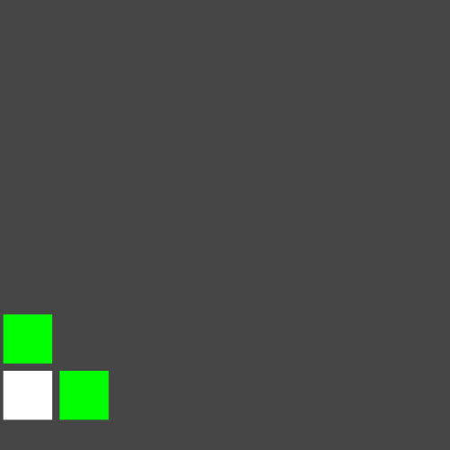
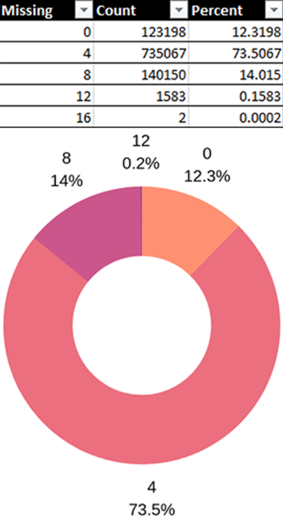
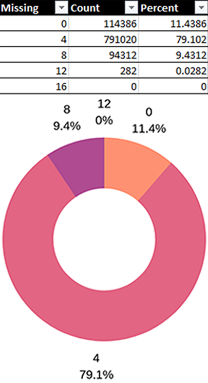

# Tetris-Shape-Grid-Fill
A simple method of filling a 2D grid with Tetris shapes

## Check Neighbours
Last Block       |  All Blocks
:-------------------------:|:-------------------------:
  |   

## Incomplete Grid Generation
Given a 8x7 grid and 1,000,000 grid generation the following stats show the likelihood of a completed grid with no missing blocks.

As the success of a completed grid is very low if this method was to be implemented a good solution would be to generate *n* number of successful grids check for duplicates and store them to be randomly chosen from.

Last Block       |  All Blocks
:-------------------------:|:-------------------------:
  |  
